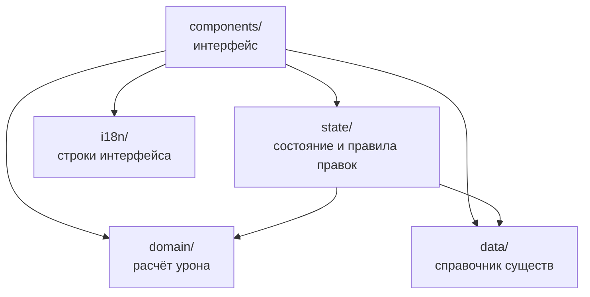

# Документация для разработчиков

Калькулятор входящего урона для **Heroes of Might and Magic: Olden Era**. Этот документ — для тех, кто хочет запустить
проект у себя, разобраться в коде или доработать его. Описание для игроков — в [README](README.md).

Читать лучше сверху вниз: сначала запуск и общая картина, потом подробности по частям. Документ —
это карта: что где лежит и как связано. Подробные объяснения «почему сделано так» написаны
в комментариях прямо в коде — ссылки на файлы ведут к ним.

## Содержание

- [О проекте](#о-проекте)
- [Быстрый старт](#быстрый-старт)
- [Как устроено](#как-устроено)
- [Структура папок](#структура-папок)
- [Части подробно](#части-подробно)
- [Тесты](#тесты)
- [Публикация](#публикация)
- [Типичные задачи](#типичные-задачи)
- [Ограничения](#ограничения)

---

## О проекте

Одностраничное приложение без сервера. Пользователь задаёт параметры двух отрядов — атакующего
и защищающегося, — а калькулятор показывает, сколько урона получит каждая сторона от удара и ответного удара: минимум, максимум и среднее, сколько существ погибнет и сколько здоровья останется у верхнего.

- **Сайт:** https://rerank.github.io/calcDmgOldenEra/
- **Источник формул:** [гайд по механике PvP-боя](https://paradrew.com/ru/olden-era/guides/pvp-combat-mechanics/)
  на paradrew.com; правило округления сверено с игрой.
- **Стек:** React 19, TypeScript 6, Vite 8, Vitest 5, линтер oxlint. Стили — обычный CSS по БЭМ,
  без фреймворков и CSS-модулей.
- **Чего нет намеренно:** сервера, маршрутизации, хранения данных между визитами — перезагрузка
  страницы очищает результаты.

---

## Быстрый старт

Нужен **Node.js 20.19+ или 22.12+** — этого требует Vite 8. Проект разрабатывается на Node 24.

```bash
git clone https://github.com/Rerank/calcDmgOldenEra.git
cd calcDmgOldenEra
npm install
npm run dev
```

Открой **http://localhost:5173/calcDmgOldenEra/** — именно с подпапкой. Сайт публикуется на GitHub
Pages в подпапку с именем репозитория, и в [vite.config.ts](vite.config.ts) она задана для всех
режимов, включая разработку. По адресу `localhost:5173/` без подпапки Vite покажет подсказку,
а не приложение.

| Команда | Что делает |
|---|---|
| `npm run dev` | дев-сервер с горячей перезагрузкой |
| `npm test` | все тесты, один прогон |
| `npx vitest` | тесты в режиме наблюдения: перезапускаются при изменении файлов |
| `npm run lint` | линтер oxlint |
| `npm run build` | проверка типов (`tsc -b`) и сборка в `dist` |
| `npm run preview` | сервер для собранного `dist` — ровно то, что уедет на сайт: http://localhost:4173/calcDmgOldenEra/ |
| `npm run predeploy` | все проверки перед публикацией, ничего не публикуя |
| `npm run deploy` | проверки, сборка и публикация на GitHub Pages — см. [Публикация](#публикация) |

---

## Как устроено

### Пять частей

| Папка | Что это | От чего зависит |
|---|---|---|
| `domain/` | расчёт урона: чистые функции, типы, игровые константы | ни от чего |
| `data/` | справочник существ и фракций | ни от чего |
| `i18n/` | строки интерфейса | ни от чего |
| `state/` | состояние формы и результатов, правила правок | `domain`, `data` |
| `components/` | интерфейс | от всех |

Стрелка на схеме — «импортирует»:



Главное правило: **чем глубже часть, тем меньше она знает**. Расчёт не знает ни про React, ни про
справочник, ни про строки интерфейса: на вход — числа и флаги, на выход — числа. Поэтому его легко
тестировать, и он не меняется, когда меняется интерфейс.

### Путь одного расчёта

1. Пользователь меняет поле. Панель стороны (`UnitSide`) передаёт наверх патч: «атака стала 9».
2. `App` отдаёт патч хуку состояния `useCalculator`, а тот — чистой функции-переходу
   из `state/transitions.ts`. Переход возвращает новый `Input`: подтягивает связанные поля и, если
   изменилось свойство самого существа, сбрасывает шаблон на «Свой».
3. Выбор существа в списке работает так же, только переход берёт параметры из справочника (`data/`).
4. «Удар» вызывает `calculate(input)` из `domain/`. Хук сохраняет слепок входных данных вместе
   с результатом — это «Итог».
5. `Results` рисует итог двумя карточками. Строки расшифровки и слепка собирает `format.ts`,
   используя словарь из `i18n/`.
6. «Закрепить» переносит итог в стопку закреплённых — дальнейшие правки формы их не трогают.

---

## Структура папок

```text
src/
├── main.tsx                 точка входа: глобальные стили и <App/>
├── App.tsx                  раскладка экрана: шапка, две стороны, удар, результаты
├── battle.css               сетка главного экрана
├── domain/                  расчёт урона — без React и без строк интерфейса
│   ├── types.ts             Side, Input, Strike, Result, Entry
│   ├── rules.ts             игровые константы (RULES), границы полей (F), значения по умолчанию
│   ├── damage.ts            calculate(): удар, ответный удар, раскладка урона по стеку
│   └── damage.test.ts
├── state/
│   ├── calculator.ts        хук useCalculator: форма, «Итог», закреплённые, анимации
│   ├── transitions.ts       чистые переходы: правка стороны, выбор шаблона, обмен сторонами
│   └── transitions.test.ts
├── data/
│   ├── creatures.ts         7 фракций и 148 существ
│   └── creatures.test.ts    целостность справочника
├── i18n/
│   ├── index.ts             активный язык и словарь: lang, t
│   └── ru.ts                все строки интерфейса
├── components/              у каждого компонента рядом лежит его CSS
│   ├── AppHeader.tsx        шапка: заголовок, формула, «Подробнее»
│   ├── UnitSide.tsx         панель стороны — одна на обе
│   ├── HeroPanel.tsx        атака и защита героя
│   ├── TemplateField.tsx    поле «Шаблон»
│   ├── templateGroups.ts    список шаблонов: группы, метки ранга, ключи поиска
│   ├── RangedFields.tsx     «Дистанционная атака» и «Штраф»
│   ├── Results.tsx          стопка результатов: «Итог» и закреплённые
│   ├── ResultPanel.tsx      панель результата: заголовок, кнопка, две колонки
│   ├── ResultCard.tsx       карточка удара: слепок, таблица, расшифровка
│   ├── ResultTable.tsx      таблица мин / макс / сред
│   ├── format.ts            строки расшифровки и слепка
│   └── ui/                  переиспользуемые элементы, ничего не знающие о калькуляторе
├── styles/
│   ├── variables.css        дизайн-токены: цвета, шрифты, размеры
│   └── base.css             сброс и общие правила
└── assets/images/           картинки, которые импортирует код

public/favicon.ico           копируется в сборку как есть
scripts/check-clean.js       проверка git перед публикацией
```

---

## Части подробно

### Расчёт урона — `domain/`

На вход — `Input`: две стороны (`Side`) и параметры удара (`ranged`, `rangePenalty`). На выход —
`Result`: удар по защищающемуся (`strike`) и ответный удар (`counter`, или `null`, если его нет).

**Формула одного удара** — [damage.ts](src/domain/damage.ts):

```text
урон = кол-во × урон существа
     × (20 + атака) / (20 + защита)
     × max(10%, 100% + исх − вх)
     × (100% − штраф)
```

- Атака и защита — **уже с бонусом героя**: `attack + heroAttack`, `defense + heroDefense`.
- `исх` («Увел. исх. урона») берётся у того, кто бьёт, `вх` («Умен. вх. урона») — у того, кто
  получает. Внутри скобки проценты складываются, а не перемножаются. Нижняя граница 10% есть только
  у этой скобки — штраф применяется поверх неё.
- **Округление — к ближайшему, один раз в самом конце, и не меньше 1.** В гайде правило не описано, оно выведено сверкой с игрой: 4 × 5–9 против защиты 5 даёт 23.2 и 41.76, а игра показывает 23 и 42. Перед округлением добавляется крошечный `EPSILON`. Без него значение, математически равное ровно половине, из-за ошибки представления дробных чисел могло бы оказаться чуть меньше неё и округлиться вниз: 5 × 3 × (20 + 0) / (20 + 1) × 75% × 70% — это ровно 7.5, а компьютер получает 7.499999999999998 и без поправки выдал бы 7 вместо 8. Поправку охраняет тест «погрешность дробных чисел не уводит ровную половину вниз» в `damage.test.ts`: убери `EPSILON` — и он упадёт.
- Считаются три ветки: минимум (`damageMin`), максимум (`damageMax`) и среднее — `(min + max) / 2`
  на одно существо.

**Штраф** — один множитель, но с двумя источниками:
- у выстрела — за дистанцию, когда включена «Дистанционная атака» (не больше 50%);
- у ответного удара — 50%, когда у защищающегося включена «Контратака 50%»: так отвечает стрелок,
  которого достали в ближнем бою.

**Раскладка урона по стеку** (`applyToStack`). Урон сначала добивает верхнее существо — оно могло
прийти в бой раненым (`topHp`), — и только потом снимает целых. Ранено всегда не больше одного
существа, поэтому одного числа `topHp` достаточно.

**Ответный удар:**
- его нет, если удар дистанционный или защищающиеся погибли все;
- отвечают **выжившие**, поэтому ветки перекрёстные: минимальный ответ — после самого сильного удара
  (выжило меньше всего), максимальный — после самого слабого. Отсюда и диапазон количества
  в расшифровке ответного удара.

**Константы** — в [rules.ts](src/domain/rules.ts):
- `RULES` — игровые числа: база 20, пол 10%, максимальный штраф за дистанцию, ослабление контратаки, минимальный урон;
- `F` — границы и шаг полей ввода. Раскладываются прямо в поле: `<NumberField {...F.count} />`;
- `DEFAULT_INPUT` — значения формы при открытии страницы.

### Состояние — `state/`

**Хук `useCalculator`** — [calculator.ts](src/state/calculator.ts) — единственное место
с React-состоянием: форма (`input`), свежий результат (`fresh`), закреплённые (`pinned`) и списки
панелей, которые сейчас играют анимацию появления или ухода. Внутри — обычный `useState`.

**Правила правок живут не в хуке, а в чистых функциях** —
[transitions.ts](src/state/transitions.ts), — поэтому тестируются без React. Каждая берёт `Input`
и возвращает новый, а если ничего не изменилось — **тот же объект**. По этому признаку хук понимает,
что убирать «Итог» не нужно: ввод того же числа или повторный выбор того же существа результат
не стирают.

| Переход | Что делает |
|---|---|
| `patchSide` | правка поля стороны; подтягивает связанные поля: урон «мин» не больше «макс», здоровье верхнего существа не больше максимального и следует за ним, пока существо цело |
| `patchAttack` | «Дистанционная атака» и «Штраф» |
| `selectTemplate` | подставляет параметры существа и делает стек целым; у атакующего выставляет «Дистанционную атаку» по справочнику |
| `swapSides` | меняет стороны местами целиком; «Дистанционную атаку» выставляет по справочнику нового атакующего, у «Своего» выключает |

**Когда шаблон сбрасывается на «Свой».** Список `CREATURE_FIELDS` — это свойства самого существа:
здоровье, атака, защита, урон, «Контратака 50%». Если изменилось любое из них, имя существа больше
не соответствует числам, и шаблон становится «Своим». Количество, раненое верхнее существо, герой,
проценты, дистанция и штраф описывают ситуацию, а не существо, и шаблон не трогают. По тому же списку шаблон и подставляется, поэтому «что подставляется» и «что сбрасывает» разойтись не могут.

**Жизнь результатов:**
- «Удар» кладёт в `fresh` запись `Entry`: слепок `input` и результат расчёта;
- любая правка формы убирает `fresh` — он посчитан по другим числам;
- «Закрепить» переносит `fresh` в начало `pinned`. У закреплённых над таблицей показывается слепок
  параметров, с которыми их посчитали;
- «Открепить» убирает панель. Наверх, в «Итог», она возвращается только как отмена случайного
  закрепления: панель единственная, место «Итога» свободно и форма с момента расчёта не менялась.
  Последнее проверяет `sameInput` — сравнение текущей формы со слепком по значениям, а не по истории
  правок: если параметр изменили и вернули обратно, слепок снова считается совпавшим.

Анимации появления и ухода привязаны к явным спискам id, а не к монтированию компонента: закрепление переставляет узел в DOM, а это перезапустило бы CSS-анимацию там, где ничего не появилось.
Длительность `ANIMATION_MS` должна совпадать с `--result-anim` в `variables.css`.

### Справочник существ — `data/`

[creatures.ts](src/data/creatures.ts) — разовая выгрузка из таблицы:
- `FACTIONS` — 7 фракций; порядок в массиве — порядок групп в списке шаблонов;
- `CREATURE_TEMPLATES` — 148 существ, по фракциям, внутри фракции — по рангу.

У существа есть `id`, имя на двух языках, фракция, ранг, здоровье, атака, защита, урон и два
необязательных флага:
- `ranged` — бьёт, не вызывая ответного удара: стрелки, снайперы, атака через гекс. У атакующего
  включает «Дистанционную атаку»;
- `counterHalved` — −50% в ближнем бою: стрелки и снайперы. Включает «Контратаку 50%».

Справочник только **заполняет поля в момент выбора** — расчёт о нём ничего не знает, и «Свой»
с теми же числами считается так же, как существо из списка. Самого «Своего» в справочнике нет:
это отсутствие шаблона, `CUSTOM_TEMPLATE_ID`.

[creatures.test.ts](src/data/creatures.test.ts) проверяет то, чего не видят типы: уникальность `id`,
правило его построения и попадание чисел в границы полей.

### Интерфейс — `components/`

```text
App
├── AppHeader                         заголовок, формула, «Подробнее»
├── UnitSide ×2                       атакующий и защищающийся — один компонент
│   ├── HeroPanel                     атака и защита героя
│   ├── TemplateField                 выбор существа (Combobox)
│   ├── PairField, NumberField,       параметры существа
│   │   Toggle
│   ├── RangedFields                  только у атакующего — через слот extra
│   └── Disclosure «Дополнительно»    проценты исх / вх
├── IconButton                        обмен сторонами
├── Button «Удар»
└── Results                           «Итог» и закреплённые
    └── ResultPanel → ResultCard ×2 → ResultTable
```

Что полезно знать:

- **Поле атаки и защиты показывает итог с героем** — ровно то число, что уходит в расчёт. Если бонус
  героя больше нуля, число подсвечивается (`--color-boosted`). Редактируется тоже итог, а в состояние
  записывается собственное значение существа — см. `withHero` в [UnitSide.tsx](src/components/UnitSide.tsx).
- **Числовые поля** — `Stepper` и `PairField` — используют общий хук
  [useNumberInput](src/components/ui/useNumberInput.ts). Пока поле редактируют, в нём виден набранный
  текст, и его можно стереть; наружу уходят только значения в границах; при уходе из поля значение
  зажимается в границы, а пустое поле возвращает прежнее.
- **Комбобокс** — [Combobox.tsx](src/components/ui/Combobox.tsx) — универсальный и про существ
  не знает. Поле — это кнопка, строка поиска — внутри раскрытого списка: на ПК поиск получает фокус
  сразу, на сенсорном экране нет, чтобы не выезжала клавиатура. На экранах до 600px список
  раскрывается на весь экран.
- **Поиск** — [comboboxFilter.ts](src/components/ui/comboboxFilter.ts) — не различает регистр,
  «ё» и «е», игнорирует апострофы. Запрос делится на слова, и каждое должно найтись. Ключи поиска
  для существ собирает [templateGroups.ts](src/components/templateGroups.ts): имя на обоих языках
  и ранг цифрой, поэтому работают запросы вроде «2» и «7 дракон».
- **Строки результата** — расшифровка формулы и слепок параметров — собираются в
  [format.ts](src/components/format.ts), а не в разметке. Нулевые проценты туда не попадают.

**Стили:**
- обычный CSS по БЭМ (`блок__элемент--модификатор`), без CSS-модулей и препроцессоров;
- у каждого компонента свой файл стилей рядом, он импортируется из `.tsx`;
- все «сырые» значения — цвета, шрифты, размеры — в [variables.css](src/styles/variables.css),
  компоненты используют только переменные;
- две контрольные ширины: до **900px** раскладка становится одноколоночной, до **600px** включаются
  компактные размеры — в основном переопределением переменных в `variables.css`;
- шрифты Spectral и JetBrains Mono подключаются из Google Fonts в `index.html`.

**Картинки и файлы.** Картинки из `src/assets/images` импортируются в коде
(`import icon from '…'`) — Vite добавит в имя хеш, а в путь — подпапку сайта. Файлы из `public/`
копируются в сборку как есть; ссылаться на них нужно путём от корня (`/favicon.ico`), подпапку Vite
подставит сам.

### Строки интерфейса — `i18n/`

Все строки — в [ru.ts](src/i18n/ru.ts), компоненты берут их через `t` из
[index.ts](src/i18n/index.ts). Имена существ и фракций живут не в словаре, а в справочнике — сразу
на двух языках (`name.ru`, `name.en`) — и выбираются через `lang`. Английского интерфейса пока нет,
но устройство на него рассчитано — см. [рецепт](#добавить-язык).

---

## Тесты

Юнит-тесты на Vitest лежат рядом с кодом, в файлах `*.test.ts`. Компонентных и сквозных (E2E)
тестов нет — интерфейс проверяется вручную в браузере.

| Файл | Что проверяет |
|---|---|
| [damage.test.ts](src/domain/damage.test.ts) | формулу, округление, пол 10%, минимум 1, штраф, ответный удар, раненый стек |
| [transitions.test.ts](src/state/transitions.test.ts) | подстановку шаблона, сброс на «Свой», обмен сторонами |
| [creatures.test.ts](src/data/creatures.test.ts) | целостность справочника |
| [comboboxFilter.test.ts](src/components/ui/comboboxFilter.test.ts) | поиск: регистр, «ё», апострофы, несколько слов |
| [templateGroups.test.ts](src/components/templateGroups.test.ts) | поиск существ по рангу |

Два принципа, которых стоит держаться:

- **Ожидания в тестах расчёта посчитаны вручную** и записаны числом. Формула в тестах не повторяется: иначе тест сверял бы код сам с собой и ничего не ловил.
- **Тесты состояния не завязаны на числа справочника.** Существо берётся по признаку («любой
  стрелок»), ожидаемые значения — из самого шаблона. Правка чисел в справочнике тесты не ломает.

```bash
npm test                          # один прогон
npx vitest                        # режим наблюдения
npx vitest run -t "раненый стек"  # только тесты, в названии которых есть этот текст
```

---

## Публикация

Сайт статический: GitHub Pages раздаёт собранную папку `dist` из отдельной ветки `gh-pages`.
**Пуш в `main` сайт не меняет** — публикация делается только явной командой. Поэтому в `main` можно
спокойно пушить работу, не готовую к показу.

### Как опубликовать

1. Закоммитить изменения в ветку `main`.
2. Выполнить `npm run deploy`.

Перед `deploy` npm сам запустит `predeploy` — так работают скрипты с приставкой `pre`:

```text
predeploy:  node scripts/check-clean.js → npm run lint → npm test → npm run build
deploy:     gh-pages -d dist --nojekyll
```

- [check-clean.js](scripts/check-clean.js) останавливает публикацию, если текущая ветка не `main`
  или есть незакоммиченные изменения, включая новые файлы. Пакет `gh-pages` публикует локальную папку,
  и без этой проверки на сайт могли бы уехать правки, которых нет ни в одном коммите.
- Первая упавшая проверка останавливает все следующие.
- `gh-pages` кладёт содержимое `dist` в ветку `gh-pages` и пушит её. Флаг `--nojekyll` отключает
  обработку Jekyll на стороне Pages: она молча выбросила бы файлы, начинающиеся с `_`.
- Через минуту-две сайт обновится. Pages кеширует страницы до 10 минут — если видна старая версия,
  обнови страницу через Ctrl+F5.

Проверить всё, ничего не публикуя: `npm run predeploy`, затем `npm run preview`.

**Откат:** `git revert <коммит>`, затем снова `npm run deploy`. Откат остаётся в истории и проходит
те же проверки.

Если `gh-pages` ругается на свою служебную копию репозитория (например, «Remote url mismatch»),
её можно удалить командой `npx gh-pages-clean` — при следующей публикации она создастся заново.

### Первая настройка — для своей копии репозитория

Если ты форкнул или скопировал проект, перед первой публикацией:

1. **Подпапка.** В [vite.config.ts](vite.config.ts) значение `base` должно совпадать с именем твоего
   репозитория **с учётом регистра**: `'/имя-репозитория/'`. Иначе сайт откроется белым экраном —
   скрипты и стили будут искаться не по тому адресу.
2. **Публичный репозиторий.** На бесплатном плане GitHub Pages работает только с публичными.
3. **Пустая ветка `gh-pages`:**
   ```bash
   git switch --orphan gh-pages
   git commit --allow-empty -m "Пустая ветка для публикации на GitHub Pages"
   git push origin gh-pages
   git switch main
   git branch -D gh-pages
   ```
   Зачем: если ветки ещё нет, пакет `gh-pages` создаёт её из копии `main` и при этом не удаляет
   файлы, начинающиеся с точки. `.gitignore`, `.oxlintrc.json` и подобные попали бы в ветку, а вместе
   с ней — на сайт. Пустая ветка это исключает. `git switch --orphan` временно убирает файлы проекта из рабочей папки — `git switch main` их возвращает.
4. **Первая публикация:** `npm run deploy`.
5. **Включить Pages:** Settings → Pages → Build and deployment → Source: *Deploy from a branch*,
   Branch: `gh-pages`, папка `/ (root)` → Save.

Через минуту-две наверху той же страницы настроек появится адрес сайта:
`https://<пользователь>.github.io/<репозиторий>/`.

---

## Типичные задачи

### Добавить или поправить существо

1. В [creatures.ts](src/data/creatures.ts) добавь объект в `CREATURE_TEMPLATES` — в блок своей
   фракции, по рангу.
2. `id` — английское имя строчными буквами, без пробелов и знаков: `Sun's Aegis` → `sunsaegis`.
3. Флаги, ложные не пишутся:
   - `ranged: true` — стрелок, снайпер или атака через гекс;
   - `counterHalved: true` — стрелок или снайпер: штраф в ближнем бою.
4. `npm test` — тест справочника поймает повтор `id`, `id` не по правилу и числа за границами полей.

В списке шаблонов и в поиске существо появится само: группы, метка ранга и ключи поиска строятся
из справочника.

- **Новая фракция** — объект в `FACTIONS`. Его место в массиве задаёт место группы в списке.
- **Ранг выше VIII** — допиши массив `ROMAN` в [templateGroups.ts](src/components/templateGroups.ts).
- **Число не помещается в поле** (например, атака больше 99) — расширь границы в `F`
  в [rules.ts](src/domain/rules.ts).

### Поменять игровую константу

1. Поменяй число в `RULES` в [rules.ts](src/domain/rules.ts). Расчёт и зависящие от него границы полей
   подхватят новое значение сами.
2. Поправь тексты, где число написано словами, — в [ru.ts](src/i18n/ru.ts):
   - `headerFormula` — формула в шапке (база 20);
   - `formulaNotes.floor` — пояснение про 90%;
   - `penaltyHint` — подсказка к штрафу (−10% за гекс, не больше −50%);
   - `weakCounter` — подпись «Контратака 50%».
3. Запусти `npm test`. Тесты расчёта упадут — ожидания в них записаны числами. Пересчитай их **вручную**
   по новой формуле, а не копируй вывод теста: иначе тест перестанет что-либо проверять.

### Добавить параметр стороне

Например, новый модификатор урона. Подсказывать будет компилятор: после первого шага `npm run build`
покажет все места, где новое поле не заполнено.

1. **Тип.** Добавь поле в `Side` — [types.ts](src/domain/types.ts).
2. **Значения.** Значение по умолчанию для обеих сторон в `DEFAULT_INPUT` и границы в `F` —
   [rules.ts](src/domain/rules.ts).
3. **Расчёт.** Учти параметр в `buildStrike` — [damage.ts](src/domain/damage.ts). Добавь тест
   с посчитанным вручную ожиданием в [damage.test.ts](src/domain/damage.test.ts) и значение
   по умолчанию в его помощник `side()`.
4. **Свойство существа или ситуация?**
   - Если параметр задаёт справочник — добавь его в тип `CreatureTemplate` и в данные,
     а в [transitions.ts](src/state/transitions.ts) — в `CREATURE_FIELDS` и `creatureFields`.
     Тогда он будет подставляться при выборе существа и сбрасывать шаблон при правке.
   - Если это ситуация, как количество, — в переходах ничего менять не нужно.
5. **Интерфейс.** Поле в [UnitSide.tsx](src/components/UnitSide.tsx), подпись в
   [ru.ts](src/i18n/ru.ts). Если поле в блоке «Дополнительно» — учти его в `hasExtras`, чтобы
   на свёрнутом блоке появлялся маркер.
6. **Результаты.** Если параметр влияет на урон — покажи его в расшифровке и слепке,
   [format.ts](src/components/format.ts).

### Добавить язык

Сейчас язык один, и `lang` с `t` — простые константы. Что понадобится:

1. Файл `src/i18n/en.ts`: `export const en: Dictionary = { … }`. Тип `Dictionary` выведен из `ru.ts`,
   поэтому TypeScript не даст пропустить ни одной строки.
2. Переключатель: `lang` и `t` в [index.ts](src/i18n/index.ts) должны стать реактивными — например,
   через React-контекст, — чтобы смена языка перерисовывала интерфейс.
3. Список шаблонов сейчас собирается один раз при загрузке модуля —
   [templateGroups.ts](src/components/templateGroups.ts). Его нужно пересобирать при смене языка.
4. Имена существ и фракций на английском уже есть в справочнике. Атрибут `lang` в `index.html` тоже
   стоит менять вместе с языком.

---

## Ограничения

Что калькулятор сознательно не учитывает или считает приближённо:

- **Уникальные способности существ** — двойные удары, атаки без ответа и прочее. В справочнике их нет.
- **Удача** — вне рамок проекта.
- **Процентные модификаторы сведены в одну пару «исх / вх».** По гайду в игре они разнесены
  по нескольким слоям, которые перемножаются; калькулятор складывает всё в одну скобку с полом 10%.
- **Штраф стрелка при собственной атаке вплотную.** −50% в ближнем бою учитывается только у ответного удара. Атаковать стрелком вплотную по своей инициативе приходится редко, поэтому отдельного переключателя нет.
- **Округление ровно половины** (x.5) — предположение: с игрой сверены только значения, не попадающие ровно на половину. Калькулятор округляет такие значения вверх.
- **Результаты не сохраняются** между визитами — перезагрузка страницы их очищает.
- **Раскрытый список шаблонов не закрывается при прокрутке страницы.** Если прокрутить страницу мимо него, список уедет вместе с полем.
