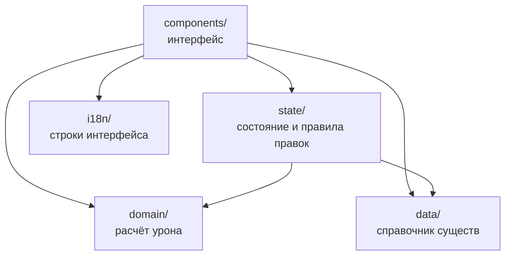

# Документация для разработчиков

Калькулятор входящего урона, сравнение армий и рейтинг существ для **Heroes of Might and Magic: Olden Era**. Этот документ —
для тех, кто хочет запустить проект у себя, разобраться в коде или доработать его. Описание для игроков —
в [README](README.md).

Читать лучше сверху вниз: сначала запуск и общая картина, потом подробности по частям. Документ —
это карта: что где лежит и как связано. Подробные объяснения «почему сделано так» написаны
в комментариях прямо в коде — ссылки на файлы ведут к ним.

## Содержание

- [О проекте](#о-проекте)
- [Быстрый старт](#быстрый-старт)
- [Как устроено](#как-устроено)
- [Структура папок](#структура-папок)
- [Части подробно](#части-подробно)
- [Тесты](#тесты)
- [Публикация](#публикация)
- [Типичные задачи](#типичные-задачи)
- [Ограничения](#ограничения)

---

## О проекте

Одностраничное приложение без сервера, в нём три экрана:

- **Калькулятор урона** (главная). Пользователь задаёт параметры двух отрядов — атакующего и защищающегося, —
  а калькулятор показывает, сколько урона получит каждая сторона от удара и ответного удара: минимум, максимум
  и среднее, сколько существ погибнет и сколько здоровья останется у верхнего.
- **Сравнение армий** (`/army/`). Пользователь собирает до девяти армий по семь отрядов, а экран сводит каждую
  к индексам урона, живучести и мощности и называет сильнейшую.
- **Рейтинг существ** (`/rating/`). Экран сравнивает существ шести фракций внутри каждого ранга по тем же
  индексам — поштучно или отрядами недельного прироста — и сводит результат по фракциям.

- **Сайт:** https://rerank.github.io/calcDmgOldenEra/, сравнение армий — https://rerank.github.io/calcDmgOldenEra/army/,
  рейтинг существ — https://rerank.github.io/calcDmgOldenEra/rating/
- **Источник формул урона:** [гайд по механике PvP-боя](https://paradrew.com/ru/olden-era/guides/pvp-combat-mechanics/)
  на paradrew.com; правило округления сверено с игрой.
- **Стек:** React 19, TypeScript 6, Vite 8, Vitest 5, линтер oxlint. Стили — обычный CSS по БЭМ,
  без фреймворков и CSS-модулей.
- **Чего нет намеренно:** сервера, библиотеки маршрутизации (экраны переключает свой маленький
  роутер), хранения данных между визитами — перезагрузка страницы возвращает всё к исходному.

---

## Быстрый старт

Нужен **Node.js 20.19+ или 22.12+** — этого требует Vite 8. Проект разрабатывается на Node 24.

```bash
git clone https://github.com/Rerank/calcDmgOldenEra.git
cd calcDmgOldenEra
npm install
npm run dev
```

Открой **http://localhost:5173/calcDmgOldenEra/** — именно с подпапкой. Сайт публикуется на GitHub
Pages в подпапку с именем репозитория, и в [vite.config.ts](vite.config.ts) она задана для всех
режимов, включая разработку. По адресу `localhost:5173/` без подпапки Vite покажет подсказку,
а не приложение. Сравнение армий — **http://localhost:5173/calcDmgOldenEra/army/**, рейтинг существ —
**http://localhost:5173/calcDmgOldenEra/rating/**.

| Команда | Что делает |
|---|---|
| `npm run dev` | дев-сервер с горячей перезагрузкой |
| `npm test` | все тесты, один прогон |
| `npx vitest` | тесты в режиме наблюдения: перезапускаются при изменении файлов |
| `npm run lint` | линтер oxlint |
| `npm run build` | проверка типов (`tsc -b`) и сборка в `dist` |
| `npm run preview` | сервер для собранного `dist` — ровно то, что уедет на сайт: http://localhost:4173/calcDmgOldenEra/ |
| `npm run predeploy` | все проверки перед публикацией, ничего не публикуя |
| `npm run deploy` | проверки, сборка и публикация на GitHub Pages — см. [Публикация](#публикация) |

---

## Как устроено

### Пять частей

| Папка | Что это | От чего зависит |
|---|---|---|
| `domain/` | расчёт урона, индексы армий и рейтинг существ: чистые функции, типы, константы | ни от чего |
| `data/` | справочник существ и фракций | ни от чего |
| `i18n/` | строки интерфейса | ни от чего |
| `state/` | состояние экранов и правила правок, адреса экранов | `domain`, `data` |
| `components/` | интерфейс | от всех |

Стрелка на схеме — «импортирует»:


```mermaid
flowchart TD
    components["components/<br>интерфейс"]
    state["state/<br>состояние и правила правок"]
    domain["domain/<br>расчёт урона"]
    data["data/<br>справочник существ"]
    i18n["i18n/<br>строки интерфейса"]

    components --> state
    components --> domain
    components --> data
    components --> i18n
    state --> domain
    state --> data
```

Главное правило: **чем глубже часть, тем меньше она знает**. Расчёт не знает ни про React, ни про
справочник, ни про строки интерфейса: на вход — числа и флаги, на выход — числа. Поэтому его легко
тестировать, и он не меняется, когда меняется интерфейс.

### Три экрана

`App` — оболочка: верхняя строка с переключателем и три экрана, каждый в `<Activity>` из React.
Скрытый экран не размонтируется — `Activity` прячет его через `display: none` и отключает его эффекты,
поэтому при переключении сохраняется всё: ввод, результаты, раскрытые блоки, прокрутка. Своё состояние
каждый экран держит сам, об оболочке он не знает. Какой экран открыт, решает адрес — см.
[Адреса экранов](#адреса-экранов--state).

### Путь одного расчёта

1. Пользователь меняет поле. Панель стороны (`UnitSide`) передаёт наверх патч: «атака стала 9».
2. Экран калькулятора (`CalculatorScreen`) отдаёт патч хуку состояния `useCalculator`, а тот — чистой функции-переходу
   из `state/transitions.ts`. Переход возвращает новый `Input`: подтягивает связанные поля и, если
   изменилось свойство самого существа, сбрасывает шаблон на «Свой».
3. Выбор существа в списке работает так же, только переход берёт параметры из справочника (`data/`).
4. «Удар» вызывает `calculate(input)` из `domain/`. Хук сохраняет слепок входных данных вместе
   с результатом — это «Итог».
5. `Results` рисует итог двумя карточками. Строки расшифровки и слепка собирает `format.ts`,
   используя словарь из `i18n/`.
6. «Закрепить» переносит итог в стопку закреплённых — дальнейшие правки формы их не трогают.

### Путь одной правки армии

1. Пользователь выбирает существо в пустой ячейке, меняет количество или убирает отряд.
   Экран армий (`ArmyScreen`) передаёт правку хуку `useArmies`, а тот — чистой функции-переходу
   из `state/armyTransitions.ts`.
2. В состоянии у отряда только id существа и количество. На каждой отрисовке хук берёт числа существ
   из справочника и считает итоги армий (`armyStats`) и их сравнение (`compareArmies`) из `domain/army.ts`.
   Кнопки «Посчитать» нет — индексы и «Итог» следуют за любой правкой.
3. Панели армий показывают индексы, «Итог» — вердикт и таблицу. Числа и проценты для показа
   собирает `components/army/armyFormat.ts`.

### Путь рейтинга

1. Пользователь выбирает категорию, ранги, фракции, вид существ или прирост либо кликает по заголовку
   столбца. Экран рейтинга (`RatingScreen`) отдаёт выбор хуку `useRating`, а тот — чистой функции-переходу
   из `state/ratingTransitions.ts`. В состоянии — только настройки показа.
2. На каждой отрисовке хук берёт существ выбранного вида (`ratingPool`) и считает их места и доли
   от лидера ранга (`rateUnits`) и сводку по фракциям (`factionSummary`) из `domain/rating.ts`.
3. Интерфейс прячет строки невыбранных рангов и фракций и сортирует остальные — `ratingGroups`
   в `components/rating/ratingRows.ts`. Числа, подписи и пример под сводкой собирает `ratingFormat.ts`.

---

## Структура папок

```text
src/
├── main.tsx                 точка входа: глобальные стили и <App/>
├── App.tsx                  оболочка: переключатель экранов и три экрана в <Activity>
├── battle.css               сетка экрана калькулятора
├── domain/                  расчёт — без React и без строк интерфейса
│   ├── types.ts             Side, Input, Strike, Result, Entry; Indices, Metric; армии; рейтинг
│   ├── rules.ts             игровые константы (RULES), правила армий (ARMY_RULES), границы полей (F),
│   │                        значения по умолчанию
│   ├── damage.ts            calculate(): удар, ответный удар, раскладка урона по стеку
│   ├── damage.test.ts
│   ├── indices.ts           индексы урона, живучести и мощности, доля от лучшего, места —
│   │                        общая математика армий и рейтинга
│   ├── indices.test.ts
│   ├── army.ts              armyStats(), compareArmies(): итог армии, доли, вердикт
│   ├── army.test.ts
│   ├── rating.ts            rateUnits(), factionSummary(): места в ранге, сводка по фракциям
│   └── rating.test.ts
├── state/
│   ├── routes.ts            экраны и их адреса — без React: его читает и сборка
│   ├── routes.test.ts
│   ├── screen.ts            хук useScreen: текущий экран, переход без перезагрузки
│   ├── calculator.ts        хук useCalculator: форма, «Итог», закреплённые, анимации
│   ├── transitions.ts       чистые переходы калькулятора: правка стороны, выбор шаблона, обмен сторонами
│   ├── transitions.test.ts
│   ├── armies.ts            хук useArmies: армии, их итоги и сравнение
│   ├── armyTransitions.ts   армии, стартовые армии и чистые переходы: армии и отряды
│   ├── armyTransitions.test.ts
│   ├── rating.ts            хук useRating: кто в рейтинге, места и сводка
│   ├── rating.test.ts
│   ├── ratingTransitions.ts настройки рейтинга и чистые переходы: категория, фильтры, сортировка
│   └── ratingTransitions.test.ts
├── data/
│   ├── creatures.ts         7 фракций и 148 существ
│   └── creatures.test.ts    целостность справочника
├── i18n/
│   ├── index.ts             активный язык и словарь: lang, t; подстановка в шаблон строки: fill
│   └── ru.ts                все строки интерфейса
├── components/              у каждого компонента рядом лежит его CSS
│   ├── AppNav.tsx           верхняя строка: название игры и переключатель экранов
│   ├── AppHeader.tsx        шапка экрана: заголовок, вводная строка, «Подробнее»
│   ├── CalculatorScreen.tsx экран калькулятора: шапка с формулой, две стороны, удар, результаты
│   ├── UnitSide.tsx         панель стороны — одна на обе
│   ├── HeroPanel.tsx        атака и защита героя
│   ├── TemplateField.tsx    поле «Шаблон»
│   ├── templateGroups.ts    список шаблонов: группы, метки ранга, ключи поиска
│   ├── RangedFields.tsx     «Дистанционная атака» и «Штраф»
│   ├── Results.tsx          стопка результатов: «Итог» и закреплённые
│   ├── ResultPanel.tsx      панель результата: заголовок, кнопка, две колонки
│   ├── ResultCard.tsx       карточка удара: слепок, таблица, расшифровка
│   ├── ResultTable.tsx      таблица мин / макс / сред
│   ├── format.ts            строки расшифровки и слепка
│   ├── creatureIcons.ts     иконки существ: id → адрес картинки
│   ├── roman.ts             римские цифры: ранги и номера армий
│   ├── army/                экран сравнения армий
│   │   ├── ArmyScreen.tsx   экран: шапка, лента армий, «Итог»
│   │   ├── ArmyPanel.tsx    панель армии: шапка, семь ячеек, индексы
│   │   ├── ArmySlot.tsx     ячейка: отряд или кнопка выбора существа
│   │   ├── ArmySummary.tsx  «Итог»: вердикт и таблица
│   │   ├── armyFormat.ts    числа, проценты, названия армий
│   │   └── narrow.ts        граница узкого экрана — та же, что в CSS
│   ├── rating/              экран рейтинга существ
│   │   ├── RatingScreen.tsx      экран: шапка, категории, фильтры, таблица, сводка
│   │   ├── RatingCategories.tsx  выбор категории: три карточки и подсказка на узком экране
│   │   ├── RatingCategory.tsx    карточка категории
│   │   ├── RatingFilters.tsx     ранг, фракция, вид существ, прирост
│   │   ├── RatingPanel.tsx       панель таблицы: заголовок, таблица, примечание
│   │   ├── RatingTable.tsx       таблица по рангам: сортировка, иконки, узкий экран
│   │   ├── RatingSummary.tsx     сводка по фракциям и пример под ней
│   │   ├── ratingRows.ts         строки таблицы: фильтр, блоки рангов, сортировка
│   │   └── ratingFormat.ts       числа, подписи, пример под сводкой
│   └── ui/                  переиспользуемые элементы, ничего не знающие о калькуляторе
├── styles/
│   ├── variables.css        дизайн-токены: цвета, шрифты, размеры
│   └── base.css             сброс и общие правила
└── assets/images/           картинки, которые импортирует код
    └── units/<фракция>/     иконки существ, 96×96 WebP

public/favicon.ico           копируется в сборку как есть
scripts/check-clean.js       проверка git перед публикацией
vite.config.ts               подпапка сайта и копия index.html для каждого экрана
```

---

## Части подробно

### Расчёт урона — `domain/`

На вход — `Input`: две стороны (`Side`) и параметры удара (`ranged`, `rangePenalty`). На выход —
`Result`: удар по защищающемуся (`strike`) и ответный удар (`counter`, или `null`, если его нет).

**Формула одного удара** — [damage.ts](src/domain/damage.ts):

```text
урон = кол-во × урон существа
     × (20 + атака) / (20 + защита)
     × max(10%, 100% + исх − вх)
     × (100% − штраф)
```

- Атака и защита — **уже с бонусом героя**: `attack + heroAttack`, `defense + heroDefense`.
- `исх` («Увел. исх. урона») берётся у того, кто бьёт, `вх` («Умен. вх. урона») — у того, кто
  получает. Внутри скобки проценты складываются, а не перемножаются. Нижняя граница 10% есть только
  у этой скобки — штраф применяется поверх неё.
- **Округление — к ближайшему, один раз в самом конце, и не меньше 1.** В гайде правило не описано, оно выведено сверкой с игрой: 4 × 5–9 против защиты 5 даёт 23.2 и 41.76, а игра показывает 23 и 42. Перед округлением добавляется крошечный `EPSILON`. Без него значение, математически равное ровно половине, из-за ошибки представления дробных чисел могло бы оказаться чуть меньше неё и округлиться вниз: 5 × 3 × (20 + 0) / (20 + 1) × 75% × 70% — это ровно 7.5, а компьютер получает 7.499999999999998 и без поправки выдал бы 7 вместо 8. Поправку охраняет тест «погрешность дробных чисел не уводит ровную половину вниз» в `damage.test.ts`: убери `EPSILON` — и он упадёт.
- Считаются три ветки: минимум (`damageMin`), максимум (`damageMax`) и среднее — `(min + max) / 2`
  на одно существо.

**Штраф** — один множитель, но с двумя источниками:
- у выстрела — за дистанцию, когда включена «Дистанционная атака» (не больше 50%);
- у ответного удара — 50%, когда у защищающегося включена «Контратака 50%»: так отвечает стрелок,
  которого достали в ближнем бою.

**Раскладка урона по стеку** (`applyToStack`). Урон сначала добивает верхнее существо — оно могло
прийти в бой раненым (`topHp`), — и только потом снимает целых. Ранено всегда не больше одного
существа, поэтому одного числа `topHp` достаточно.

**Ответный удар:**
- его нет, если удар дистанционный или защищающиеся погибли все;
- отвечают **выжившие**, поэтому ветки перекрёстные: минимальный ответ — после самого сильного удара
  (выжило меньше всего), максимальный — после самого слабого. Отсюда и диапазон количества
  в расшифровке ответного удара.

**Константы** — в [rules.ts](src/domain/rules.ts):
- `RULES` — игровые числа: база 20, пол 10%, максимальный штраф за дистанцию, ослабление контратаки, минимальный урон;
- `F` — границы и шаг полей ввода. Раскладываются прямо в поле: `<NumberField {...F.count} />`;
- `DEFAULT_INPUT` — значения формы при открытии страницы.

### Индексы — `domain/indices.ts`

Общая математика сравнения армий и рейтинга существ. Набор отрядов сводится к трём числам:

```text
индекс урона      D = Σ кол-во × средний урон × (20 + атака) / 20
индекс живучести  H = Σ кол-во × здоровье × (20 + защита) / 20
индекс мощности     = √(D × H)
```

- D — сколько урона армия наносит за один залп по цели с нулевой защитой, H — сколько урона от удара
  с нулевой атакой она выдержит. Настоящие защита цели и атака врага одинаковы для всех сравниваемых
  армий и при сравнении сокращаются.
- **Произведение, а не сумма:** армия А уничтожит армию Б за H(Б) / D(А) ходов, поэтому побеждает та,
  у кого D × H больше. **Корень** возвращает масштаб: вдвое больше тех же существ — вдвое больше мощности,
  и проценты разницы читаются естественно.
- **Рейтинг — то же сравнение в другом представлении:** существо — это армия из одного отряда. Поштучно —
  из одного существа, с приростом — из недельного прироста. Поэтому формулы у экранов одни.
- `indicesOf(отряды, герой?)` — индексы набора отрядов. Бонус героя прибавляется к атаке и защите каждого
  существа, но в интерфейсе героя пока нет — параметр необязательный, по умолчанию 0.
  Отряд описан по форме (`ArmyUnit`), поэтому шаблон справочника подходит расчёту сам,
  а справочника расчёт по-прежнему не знает.
- `shareOf` — доля от лучшего значения, `nearlyEqual` — равенство с допуском, `placeAmong` — место
  среди соперников: равные делят место, следующее пропускается — 1, 2, 2, 4.
- **Допуск `EPSILON`.** Суммы по разным отрядам складываются в разном порядке и расходятся в последних
  знаках: 0,1 + 0,2 — это 0.30000000000000004, а 1 − 0,97 — 0.030000000000000027. Без допуска равные
  не поделили бы лидерство и место, а ровно 3% не считались бы ничьей. Допуск охраняют тесты
  в `indices.test.ts` и `army.test.ts`: убери его — и они упадут.
- Индексы — дробные, округляются только при показе.

### Сравнение армий — `domain/army.ts`

- `armyStats(отряды, герой?)` — итог одной армии: индексы из `indicesOf` и численность — по ней видно,
  что армия пустая.
- `compareArmies(итоги)` — в каждой колонке доля от лучшего значения (`share`, из неё строятся полоска
  и процент отставания) и признак лидера; по мощности — вердикт: `leader`, `tie` или `none`,
  если существа есть меньше чем в двух армиях. Пустая армия ни с кем не соревнуется.
- **Ничья** — отставание по мощности не больше `ARMY_RULES.tieThreshold` (3%) в [rules.ts](src/domain/rules.ts).
  Ничьей считается разница в пределах 1–3%, взята верхняя граница: победителя называем, только когда
  отрыв уверенный. Ровно 3% — ещё ничья.

### Рейтинг существ — `domain/rating.ts`

Существо в рейтинге (`RatedUnit`) — параметры по форме `ArmyUnit`, ранг, фракция и недельный прирост.
Сравниваются существа только внутри своего ранга: дракон и мечник в одном списке ничего бы друг о друге
не сказали.

- `rateUnits(существа, метрика, заНеделю)` — для каждого существа: индекс выбранной метрики (одного
  существа или недельного отряда), доля от лидера ранга, место в ранге и место поштучно — по нему видно,
  насколько существо поднялось или опустилось с приростом. Мощность недельного отряда — мощность одного
  существа, умноженная на прирост: так выходит из формулы, отдельно это не считается. Результат —
  в том же порядке, что существа на входе.
- `factionSummary(существа, рейтинг, показать?)` — сводка по фракциям. В ячейке — средняя доля от лидера
  у существ фракции в ранге, в строке — среднее по рангам, фракции — по его убыванию. В каждом ранге
  отмечены лучшая и худшая фракции, равные делят звание. Если у фракции нет существ ранга, ячейка пустая
  и в среднее не входит — с нынешним справочником так не бывает.
- `показать` — какие ранги и фракции попадут в сводку; не указано — все. Доли от этого не меняются:
  они посчитаны от лидера всего ранга. Меняются столбцы и строки, а с ними среднее — оно по показанным
  рангам — и лучшие с худшими — они среди показанных фракций.
- Доли сводка берёт из рейтинга, поэтому следует за метрикой, приростом и тем, кого сравнивают, —
  см. [Состояние рейтинга](#состояние-рейтинга--stateratingts).

### Состояние — `state/`

**Хук `useCalculator`** — [calculator.ts](src/state/calculator.ts) — единственное место
с React-состоянием калькулятора: форма (`input`), свежий результат (`fresh`), закреплённые (`pinned`) и списки
панелей, которые сейчас играют анимацию появления или ухода. Внутри — обычный `useState`.

**Правила правок живут не в хуке, а в чистых функциях** —
[transitions.ts](src/state/transitions.ts), — поэтому тестируются без React. Каждая берёт `Input`
и возвращает новый, а если ничего не изменилось — **тот же объект**. По этому признаку хук понимает,
что убирать «Итог» не нужно: ввод того же числа или повторный выбор того же существа результат
не стирают.

| Переход | Что делает |
|---|---|
| `patchSide` | правка поля стороны; подтягивает связанные поля: урон «мин» не больше «макс», здоровье верхнего существа не больше максимального и следует за ним, пока существо цело |
| `patchAttack` | «Дистанционная атака» и «Штраф» |
| `selectTemplate` | подставляет параметры существа и делает стек целым; у атакующего выставляет «Дистанционную атаку» по справочнику |
| `swapSides` | меняет стороны местами целиком; «Дистанционную атаку» выставляет по справочнику нового атакующего, у «Своего» выключает |

**Когда шаблон сбрасывается на «Свой».** Список `CREATURE_FIELDS` — это свойства самого существа:
здоровье, атака, защита, урон, «Контратака 50%». Если изменилось любое из них, имя существа больше
не соответствует числам, и шаблон становится «Своим». Количество, раненое верхнее существо, герой,
проценты, дистанция и штраф описывают ситуацию, а не существо, и шаблон не трогают. По тому же списку шаблон и подставляется, поэтому «что подставляется» и «что сбрасывает» разойтись не могут.

**Жизнь результатов:**
- «Удар» кладёт в `fresh` запись `Entry`: слепок `input` и результат расчёта;
- любая правка формы убирает `fresh` — он посчитан по другим числам;
- «Закрепить» переносит `fresh` в начало `pinned`. У закреплённых над таблицей показывается слепок
  параметров, с которыми их посчитали;
- «Открепить» убирает панель. Наверх, в «Итог», она возвращается только как отмена случайного
  закрепления: панель единственная, место «Итога» свободно и форма с момента расчёта не менялась.
  Последнее проверяет `sameInput` — сравнение текущей формы со слепком по значениям, а не по истории
  правок: если параметр изменили и вернули обратно, слепок снова считается совпавшим.

Анимации появления и ухода привязаны к явным спискам id, а не к монтированию компонента: закрепление переставляет узел в DOM, а это перезапустило бы CSS-анимацию там, где ничего не появилось.
Длительность `ANIMATION_MS` должна совпадать с `--result-anim` в `variables.css`.

### Состояние армий — `state/armies.ts`

Устроено так же, как у калькулятора: хук `useArmies` — `useState` за фасадом, правила правок — чистые
функции в [armyTransitions.ts](src/state/armyTransitions.ts), и если переход ничего не меняет, он
возвращает тот же массив.

- **Армия — всегда 7 ячеек** (`ARMY_RULES.slots`), пустая ячейка — `null`. В ячейке только id существа
  и количество: числа существа берутся из справочника при расчёте. В армии их не правят, поэтому
  копировать их в состояние незачем — в отличие от сторон калькулятора.
- **Армий от 1 до 9** (`ARMY_RULES.minArmies`, `maxArmies`). Номер армии — её место в списке, римской
  цифрой из [roman.ts](src/components/roman.ts): убрали армию из середины — номера следующих сдвигаются.
  Ключ для React — `id`, а не номер.
- **Новый отряд — одно существо.** На ПК с мышью фокус сразу встаёт в его количество и выделяет «1»:
  набранное число её заменит. Куда встал отряд, говорит `landingSlot` — им пользуются и переход, и экран,
  поэтому разойтись они не могут.
- **ПК и узкий экран обращаются с ячейками по-разному** — флаг `narrow` у переходов:
  - на ПК видны все семь ячеек, как в игре: удалённый отряд оставляет дыру, новый встаёт ровно
    в кликнутую ячейку;
  - на узком экране (до 900px) место дороже, и армия всегда сжата: удаление сдвигает остальных вверх,
    новый отряд встаёт в конец. Дыры, оставшиеся с ПК (повернули планшет), убирает первое же
    добавление или удаление, а до тех пор их прячет CSS.

  Раскладку интерфейс проверяет в момент клика — `isNarrow()` в
  [narrow.ts](src/components/army/narrow.ts). Граница 900px там должна совпадать с медиазапросами CSS.
- `DEFAULT_ARMIES` — армии при открытии экрана: две армии II–IV рангов, близкие по силе.

### Состояние рейтинга — `state/rating.ts`

Устроено как у армий: хук `useRating` — `useState` за фасадом, правила правок — чистые функции
в [ratingTransitions.ts](src/state/ratingTransitions.ts), и если переход ничего не меняет, он возвращает
тот же объект. В состоянии только выбор пользователя — рейтинг выводится из него на каждой отрисовке:
это 126 существ и несколько умножений на каждое, кешировать нечего.

- **Кто в рейтинге** — существа с приростом (`RATED_CREATURES`): их нанимают в городе. Одним правилом
  отсекаются нейтралы и Огненная личинка — её призывает герой. Ранги и фракции для кнопок фильтра
  выводятся из этого же списка.
- **Фильтры бывают двух видов:**
  - ранг и фракция только прячут строки — места и доли по-прежнему считаются среди всех существ ранга.
    В таблице прячет интерфейс, `ratingGroups` в [ratingRows.ts](src/components/rating/ratingRows.ts).
    В сводке они выбирают столбцы и строки: «Среднее» — по выбранным рангам, лучшая и худшая —
    среди выбранных фракций. Если выбран один ранг или одна фракция, сводки нет: сравнивать в ней
    нечего;
  - вид существ — «Все», «Базовые», «Улучшенные» — решает, кто соревнуется: невыбранных для рейтинга
    будто нет. `ratingPool(вид)` отбирает существ до расчёта, поэтому места, доли, место поштучно
    и сводка считаются только среди выбранных. Примечание под таблицей говорит, среди кого посчитано.

| Переход | Что делает |
|---|---|
| `setMetric` | категория: урон, живучесть или мощность |
| `setKind` | вид существ; выбран ровно один |
| `toggleTier`, `allTiers` | ранг включается и выключается, можно несколько; пустой выбор — «Все», и снятый последним ранг возвращает «Все» |
| `toggleFaction`, `allFactions` | то же для фракций |
| `setWeekly` | «Учитывать прирост»; при выключении сортировка по «Прирост» и «Поштучно» возвращается к индексу — этих столбцов больше нет |
| `sortBy` | новый столбец — в его направлении по умолчанию: места и названия по возрастанию, числа по убыванию; тот же столбец — в обратном |

Сортировка одна на все ранги: строки сортируются внутри своего ранга. При равенстве — по индексу ▼,
дальше порядок справочника.

### Адреса экранов — `state/`

У каждого экрана свой адрес: главная — калькулятор, `/army/` — сравнение армий, `/rating/` — рейтинг
существ. Библиотеки маршрутизации нет, весь роутер — два файла:

- [routes.ts](src/state/routes.ts) — список экранов (`ROUTES`) и чистые функции «адрес ↔ экран».
  Модуль без React и без `import.meta.env`: его читает и сборка.
- [screen.ts](src/state/screen.ts) — хук `useScreen`: текущий экран из адреса, переход через
  `history.pushState` без перезагрузки, «Назад» и «Вперёд» — через событие `popstate`.

Пункты переключателя — настоящие ссылки ([AppNav.tsx](src/components/AppNav.tsx)): обычный клик
переключает экран без перезагрузки, а Ctrl-клик и средняя кнопка открывают его в новой вкладке.
Заголовок вкладки браузера меняется вместе с экраном — строки `screens` в [ru.ts](src/i18n/ru.ts).

**Копия index.html для каждого экрана.** GitHub Pages раздаёт только файлы: прямая ссылка на `/army/`
и обновление страницы идут к серверу, а тот ищет `army/index.html` и без него отдаёт свою 404. Поэтому
плагин `screenPages` в [vite.config.ts](vite.config.ts) кладёт при сборке копию `index.html` по адресу
каждого экрана, кроме главной. Это то же приложение — скрипты подключены абсолютными путями, экран
оно определит по адресу само, — отличается только `<title>`. Дев-сервер и `npm run preview` отдают
приложение по любому адресу, поэтому локально копии не нужны: проверить их можно только в `dist`
или на сайте.

### Справочник существ — `data/`

[creatures.ts](src/data/creatures.ts) — разовая выгрузка из таблицы:
- `FACTIONS` — 7 фракций; порядок в массиве — порядок групп в списке шаблонов;
- `CREATURE_TEMPLATES` — 148 существ, по фракциям, внутри фракции — по рангу.

У существа есть `id`, имя на двух языках, фракция, ранг, здоровье, атака, защита, урон и два
необязательных флага:
- `ranged` — бьёт, не вызывая ответного удара: стрелки, снайперы, атака через гекс. У атакующего
  включает «Дистанционную атаку»;
- `counterHalved` — −50% в ближнем бою: стрелки и снайперы. Включает «Контратаку 50%».

Ещё два необязательных поля нужны рейтингу существ:
- `growth` — базовый недельный прирост. Он одинаков у всех существ одного ранга во фракции. У нейтралов
  и у Огненной личинки прироста нет: их не нанимают в городе. По приросту рейтинг решает, кто в нём
  участвует, а с «Учитывать прирост» сравнивает отряды недельного прироста;
- `upgraded` — улучшенное существо. В каждом ранге фракции — базовое существо и два улучшения на выбор,
  у базового флага нет. Нет его и у нейтралов с Огненной личинкой. По нему работает фильтр «Существа».

Справочник только **заполняет поля в момент выбора** — расчёт о нём ничего не знает, и «Свой»
с теми же числами считается так же, как существо из списка. Самого «Своего» в справочнике нет:
это отсутствие шаблона, `CUSTOM_TEMPLATE_ID`.

[creatures.test.ts](src/data/creatures.test.ts) проверяет то, чего не видят типы: уникальность `id`,
правило его построения, попадание чисел в границы полей, прирост — он есть у всех существ фракций,
кроме Огненной личинки, и одинаков внутри ранга, — и состав рангов: у каждой фракции в каждом ранге
базовое существо и два улучшения. На состав опирается примечание под таблицей рейтинга («среди всех
18 существ ранга», «среди 6 базовых», «среди 12 улучшенных»).

**Иконки существ** лежат в `src/assets/images/units/<фракция>/` — WebP 96×96 с прозрачностью, 2–6 КБ.
Файл назван по английскому имени: пробелы заменены на `_`, апострофы выброшены — `Sun's Aegis` →
`Suns_Aegis.webp`. Имя файла строчными и без знаков — ровно `id` существа, поэтому
[creatureIcons.ts](src/components/creatureIcons.ts) сопоставляет их сам, без таблицы соответствий.

- Иконки подключаются через `import.meta.glob` с `?no-inline`. Без него Vite вшил бы в JS все картинки
  меньше 4 КБ — это 103 иконки из 148, — и сжатый бандл вырос бы в пять раз, в том числе для тех, кто
  сравнение армий и рейтинг не открывает. Отдельный файл грузится, только когда иконку показывают, а хеш в его
  имени меняется только вместе с картинкой — кеш браузера переживает любые правки кода.
- [creatureIcons.test.ts](src/components/creatureIcons.test.ts) проверяет, что у каждого существа есть
  файл с правильным именем в папке своей фракции и что лишних файлов нет.

### Интерфейс — `components/`

```text
App
├── AppNav                                название игры и переключатель экранов
├── Activity → CalculatorScreen           калькулятор урона
│   ├── AppHeader                         заголовок, формула, «Подробнее»
│   ├── UnitSide ×2                       атакующий и защищающийся — один компонент
│   │   ├── HeroPanel                     атака и защита героя
│   │   ├── TemplateField                 выбор существа (Combobox)
│   │   ├── PairField, NumberField,       параметры существа
│   │   │   Toggle
│   │   ├── RangedFields                  только у атакующего — через слот extra
│   │   └── Disclosure «Дополнительно»    проценты исх / вх
│   ├── IconButton                        обмен сторонами
│   ├── Button «Удар»
│   └── Results                           «Итог» и закреплённые
│       └── ResultPanel → ResultCard ×2 → ResultTable
├── Activity → ArmyScreen                 сравнение армий
│   ├── AppHeader                         заголовок, описание, «Подробнее»
│   ├── ArmyPanel ×1–9                    армия: шапка, семь ячеек, индексы
│   │   └── ArmySlot ×7                   отряд (Stepper) или выбор существа (Combobox)
│   ├── Button «Добавить армию»
│   └── ArmySummary                       «Итог»: вердикт и таблица
└── Activity → RatingScreen               рейтинг существ
    ├── AppHeader                         заголовок, описание, «Подробнее»
    ├── RatingCategories                  урон, живучесть, мощность
    │   └── RatingCategory ×3
    ├── RatingFilters                     ранг, фракция, существа (Button), прирост (Toggle)
    ├── RatingPanel → RatingTable         таблица по рангам
    └── RatingSummary                     сводка по фракциям и пример под ней
```

Что полезно знать:

- **Поле атаки и защиты показывает итог с героем** — ровно то число, что уходит в расчёт. Если бонус
  героя больше нуля, число подсвечивается (`--color-boosted`). Редактируется тоже итог, а в состояние
  записывается собственное значение существа — см. `withHero` в [UnitSide.tsx](src/components/UnitSide.tsx).
- **Числовые поля** — `Stepper` и `PairField` — используют общий хук
  [useNumberInput](src/components/ui/useNumberInput.ts). Пока поле редактируют, в нём виден набранный
  текст, и его можно стереть; наружу уходят только значения в границах; при уходе из поля значение
  зажимается в границы, а пустое поле возвращает прежнее.
- **Комбобокс** — [Combobox.tsx](src/components/ui/Combobox.tsx) — универсальный и про существ
  не знает. Поле — это кнопка, строка поиска — внутри раскрытого списка: на ПК поиск получает фокус
  сразу, на сенсорном экране нет, чтобы не выезжала клавиатура.
  - На узком экране список раскрывается на весь экран. Границу задаёт `fullscreenQuery`: у поля
    «Шаблон» — 600px, у ячеек армии — 900px, потому что там ячейка стоит в ленте с прокруткой,
    и выпавший под ней список лента обрезала бы.
  - Вместо поля-селекта может быть своя кнопка (`trigger`) — так устроена пустая ячейка армии «+».
    Список тогда шириной с поле «Шаблон» (340px), а если вправо не помещается — выравнивается
    по правому краю кнопки.
- **Панели армий и их «Итог»** — микс с `result-panel`: фон, рамку, тень и шапку даёт он, поэтому
  они выглядят как результаты калькулятора. Компоненты армий импортируют `result-panel.css` раньше
  своих стилей — свои правила идут следом и перекрывают его. Так же устроены фильтры, таблица
  и сводка рейтинга.
- **Цвет метрики** — урон красный, живучесть синяя, мощность золотая — задаёт переменная
  `--metric-accent`. Её ставит модификатор блока (`army-stat--power`, `rating--damage`,
  `rating-category--hardiness`), а элементы берут цвет из неё — как `--side-accent` у сторон боя.
- **Таблица рейтинга на узком экране — чистый CSS.** Видны место, существо и индекс; фракция
  и характеристики уходят строкой под имя, доля от лидера — под индекс, сдвиг места — под место.
  Эти элементы есть в разметке всегда, какие видны — решают медиазапросы. С приростом таблица
  получает модификатор `rating-table--weekly`: столбцов больше, и характеристики стоят плотнее,
  чтобы длинные имена рядом с иконкой не переносились.
- **Иконки в таблице рейтинга** грузятся лениво (`loading="lazy"`): пока экран скрыт или строка далеко
  внизу, картинку не запрашивают. Подписи существа выровнены по базовой линии (`align-self: baseline`):
  иначе на узком экране ячейка взяла бы базовую линию у иконки, и имя встало бы выше места и индекса.
- **Строки таблицы рейтинга** — фильтр и сортировку — собирает [ratingRows.ts](src/components/rating/ratingRows.ts),
  а не состояние: названия сортируются по алфавиту языка интерфейса, как список шаблонов.
- **Пример под сводкой** — `summaryExample` в [ratingFormat.ts](src/components/rating/ratingFormat.ts).
  Он собирается из той же сводки, поэтому следует за категорией, видом существ и приростом и не устаревает
  при правке справочника. Пример называет лидера I ранга и разбирает первую по сводке фракцию, у которой
  его нет: иначе все доли в примере считались бы от существа той же фракции, и 100% читались бы как
  «лучшее существо своей фракции». Лидер бывает у первой строки, и у второй, и у третьей — поэтому правило,
  а не номер строки. Ранг и фракция примера — из показанных в сводке, а лидера пример называет, даже
  если его фракция скрыта фильтром: 100% считаются от него.
- **Поиск** — [comboboxFilter.ts](src/components/ui/comboboxFilter.ts) — не различает регистр,
  «ё» и «е», игнорирует апострофы. Запрос делится на слова, и каждое должно найтись. Ключи поиска
  для существ собирает [templateGroups.ts](src/components/templateGroups.ts): имя на обоих языках
  и ранг цифрой, поэтому работают запросы вроде «2» и «7 дракон».
- **Строки результата** — расшифровка формулы и слепок параметров — собираются в
  [format.ts](src/components/format.ts), а не в разметке. Нулевые проценты туда не попадают.

**Стили:**
- обычный CSS по БЭМ (`блок__элемент--модификатор`), без CSS-модулей и препроцессоров;
- у каждого компонента свой файл стилей рядом, он импортируется из `.tsx`;
- все «сырые» значения — цвета, шрифты, размеры — в [variables.css](src/styles/variables.css),
  компоненты используют только переменные;
- две контрольные ширины: до **900px** раскладка калькулятора становится одноколоночной, армии
  встают горизонтальной лентой со свайпом, а в таблице рейтинга остаются место, существо и индекс;
  до **600px** включаются компактные размеры — в основном переопределением переменных в `variables.css`;
- шрифты Spectral и JetBrains Mono подключаются из Google Fonts в `index.html`.

**Картинки и файлы.** Картинки из `src/assets/images` импортируются в коде
(`import icon from '…'`) — Vite добавит в имя хеш, а в путь — подпапку сайта. Файлы из `public/`
копируются в сборку как есть; ссылаться на них нужно путём от корня (`/favicon.ico`), подпапку Vite
подставит сам.

### Строки интерфейса — `i18n/`

Все строки — в [ru.ts](src/i18n/ru.ts), компоненты берут их через `t` из
[index.ts](src/i18n/index.ts). Имена существ и фракций живут не в словаре, а в справочнике — сразу
на двух языках (`name.ru`, `name.en`) — и выбираются через `lang`. Английского интерфейса пока нет,
но устройство на него рассчитано — см. [рецепт](#добавить-язык).

Фразы, в которые подставляются значения, — шаблоны с ключами в фигурных скобках:
`'Например, в {tier} ранге 100% — это лидер ранга, {leaders}.'`. Подставляет их `fill`
из [index.ts](src/i18n/index.ts). Шаблон, а не склейка кусков: в переводе порядок слов может быть
другим. Названия в шаблонах стоят так, чтобы их не нужно было склонять: «у фракции Рой», а не «у Роя».

---

## Тесты

Юнит-тесты на Vitest лежат рядом с кодом, в файлах `*.test.ts`. Компонентных и сквозных (E2E)
тестов нет — интерфейс проверяется вручную в браузере.

| Файл | Что проверяет |
|---|---|
| [damage.test.ts](src/domain/damage.test.ts) | формулу, округление, пол 10%, минимум 1, штраф, ответный удар, раненый стек |
| [indices.test.ts](src/domain/indices.test.ts) | формулы индексов на армиях из макета, примере «было / стало» и одном существе, бонус героя; доли, места с общими, погрешность дробных чисел |
| [army.test.ts](src/domain/army.test.ts) | итог армии: численность и бонус героя; доли, лидеров, ничью ровно на 3%, пустые армии |
| [rating.test.ts](src/domain/rating.test.ts) | места и доли внутри ранга, место поштучно, прирост, мощность недельного отряда; сводку: средние, лучшие и худшие, пустые ячейки, выбранные ранги и фракции |
| [transitions.test.ts](src/state/transitions.test.ts) | подстановку шаблона, сброс на «Свой», обмен сторонами |
| [armyTransitions.test.ts](src/state/armyTransitions.test.ts) | лимиты армий, дыры на ПК и сжатие на узком экране, куда встаёт отряд, стартовые армии |
| [ratingTransitions.test.ts](src/state/ratingTransitions.test.ts) | «Все» у рангов и фракций, вид существ, направления сортировки, сброс сортировки без прироста |
| [rating.test.ts](src/state/rating.test.ts) | кто в рейтинге, кнопки фильтров, базовые и улучшенные делят рейтинг без остатка |
| [routes.test.ts](src/state/routes.test.ts) | адреса экранов: со слешем и без, чужие и неизвестные |
| [creatures.test.ts](src/data/creatures.test.ts) | целостность справочника, прирост, состав рангов |
| [creatureIcons.test.ts](src/components/creatureIcons.test.ts) | у каждого существа есть иконка, лишних нет |
| [armyFormat.test.ts](src/components/army/armyFormat.test.ts) | числа с разрядами, проценты отставания, номера армий |
| [ratingRows.test.ts](src/components/rating/ratingRows.test.ts) | фильтры прячут строки, не меняя мест; сортировку по разным столбцам, равные — по индексу |
| [ratingFormat.test.ts](src/components/rating/ratingFormat.test.ts) | числа рейтинга (и 17,825 → «17,83»), сдвиг места, строку под именем, пример под сводкой |
| [comboboxFilter.test.ts](src/components/ui/comboboxFilter.test.ts) | поиск: регистр, «ё», апострофы, несколько слов |
| [templateGroups.test.ts](src/components/templateGroups.test.ts) | поиск существ по рангу |

Два принципа, которых стоит держаться:

- **Ожидания в тестах расчёта посчитаны вручную** и записаны числом. Формула в тестах не повторяется: иначе тест сверял бы код сам с собой и ничего не ловил.
- **Тесты состояния не завязаны на числа справочника.** Существо берётся по признаку («любой
  стрелок»), ожидаемые значения — из самого шаблона. Правка чисел в справочнике тесты не ломает.

```bash
npm test                          # один прогон
npx vitest                        # режим наблюдения
npx vitest run -t "раненый стек"  # только тесты, в названии которых есть этот текст
```

---

## Публикация

Сайт статический: GitHub Pages раздаёт собранную папку `dist` из отдельной ветки `gh-pages`.
**Пуш в `main` сайт не меняет** — публикация делается только явной командой. Поэтому в `main` можно
спокойно пушить работу, не готовую к показу.

### Как опубликовать

1. Закоммитить изменения в ветку `main`.
2. Выполнить `npm run deploy`.

Перед `deploy` npm сам запустит `predeploy` — так работают скрипты с приставкой `pre`:

```text
predeploy:  node scripts/check-clean.js → npm run lint → npm test → npm run build
deploy:     gh-pages -d dist --nojekyll
```

- [check-clean.js](scripts/check-clean.js) останавливает публикацию, если текущая ветка не `main`
  или есть незакоммиченные изменения, включая новые файлы. Пакет `gh-pages` публикует локальную папку,
  и без этой проверки на сайт могли бы уехать правки, которых нет ни в одном коммите.
- Первая упавшая проверка останавливает все следующие.
- `gh-pages` кладёт содержимое `dist` в ветку `gh-pages` и пушит её. Флаг `--nojekyll` отключает
  обработку Jekyll на стороне Pages: она молча выбросила бы файлы, начинающиеся с `_`.
- Через минуту-две сайт обновится. Pages кеширует страницы до 10 минут — если видна старая версия,
  обнови страницу через Ctrl+F5.
- Стоит открыть прямой ссылкой и обновить не только главную, но и `/army/` с `/rating/`: копию `index.html`
  для экрана кладёт сборка (см. [Адреса экранов](#адреса-экранов--state)), и без неё GitHub Pages
  ответил бы 404. Локально, на `npm run preview`, эту ошибку не увидеть.

Проверить всё, ничего не публикуя: `npm run predeploy`, затем `npm run preview`.

**Откат:** `git revert <коммит>`, затем снова `npm run deploy`. Откат остаётся в истории и проходит
те же проверки.

Если `gh-pages` ругается на свою служебную копию репозитория (например, «Remote url mismatch»),
её можно удалить командой `npx gh-pages-clean` — при следующей публикации она создастся заново.

### Первая настройка — для своей копии репозитория

Если ты форкнул или скопировал проект, перед первой публикацией:

1. **Подпапка.** В [vite.config.ts](vite.config.ts) значение `base` должно совпадать с именем твоего
   репозитория **с учётом регистра**: `'/имя-репозитория/'`. Иначе сайт откроется белым экраном —
   скрипты и стили будут искаться не по тому адресу.
2. **Публичный репозиторий.** На бесплатном плане GitHub Pages работает только с публичными.
3. **Пустая ветка `gh-pages`:**
   ```bash
   git switch --orphan gh-pages
   git commit --allow-empty -m "Пустая ветка для публикации на GitHub Pages"
   git push origin gh-pages
   git switch main
   git branch -D gh-pages
   ```
   Зачем: если ветки ещё нет, пакет `gh-pages` создаёт её из копии `main` и при этом не удаляет
   файлы, начинающиеся с точки. `.gitignore`, `.oxlintrc.json` и подобные попали бы в ветку, а вместе
   с ней — на сайт. Пустая ветка это исключает. `git switch --orphan` временно убирает файлы проекта из рабочей папки — `git switch main` их возвращает.
4. **Первая публикация:** `npm run deploy`.
5. **Включить Pages:** Settings → Pages → Build and deployment → Source: *Deploy from a branch*,
   Branch: `gh-pages`, папка `/ (root)` → Save.

Через минуту-две наверху той же страницы настроек появится адрес сайта:
`https://<пользователь>.github.io/<репозиторий>/`.

---

## Типичные задачи

### Добавить или поправить существо

1. В [creatures.ts](src/data/creatures.ts) добавь объект в `CREATURE_TEMPLATES` — в блок своей
   фракции, по рангу.
2. `id` — английское имя строчными буквами, без пробелов и знаков: `Sun's Aegis` → `sunsaegis`.
3. Флаги, ложные не пишутся:
   - `ranged: true` — стрелок, снайпер или атака через гекс;
   - `counterHalved: true` — стрелок или снайпер: штраф в ближнем бою.
4. `growth` — недельный прирост, строкой после ранга. У существа фракции он обязателен и такой же,
   как у остальных существ его ранга; у нейтрала его нет.
5. `upgraded: true` — строкой после прироста, если существо — улучшение. У базового существа
   и у нейтрала флага нет.
6. Иконку 96×96 в WebP положи в `src/assets/images/units/<фракция>/` под английским именем:
   пробелы — `_`, апострофы выбросить, регистр как в имени: `Sun's Aegis` → `Suns_Aegis.webp`.
7. `npm test` — тест справочника поймает повтор `id`, `id` не по правилу, числа за границами полей,
   прирост, которого нет или который не совпал с рангом, и ранг, где у фракции не одно базовое
   существо и два улучшения; тест иконок — иконку с неправильным именем, в чужой папке или её отсутствие.

В списке шаблонов, в поиске, в ячейках армии и в рейтинге (если у существа есть прирост) оно
появится само: группы, метка ранга, ключи поиска и иконка находятся по справочнику.

- **Новая фракция** — объект в `FACTIONS` и папка для иконок с её `id`. Место объекта в массиве задаёт
  место группы в списке. Тест справочника напомнит поправить примечание под таблицей рейтинга:
  в нём написано, среди скольких существ ранга считаются места (`ratingNotePool` в [ru.ts](src/i18n/ru.ts)).
- **Ранг выше IX** — допиши массив `ROMAN` в [roman.ts](src/components/roman.ts). Им же нумеруются
  армии: тест в `armyFormat.test.ts` не даст поднять предел армий выше длины массива.
- **Число не помещается в поле** (например, атака больше 999) — расширь границы в `F`
  в [rules.ts](src/domain/rules.ts). Поле атаки и защиты показывает сумму с героем, поэтому
  в нём бывает четыре цифры: 999 + 99 = 1098 — столько поле вмещает и на ПК, и на телефоне.
  Для пяти цифр расширь само поле — переменная `--stepper-input-width` в `variables.css`.

### Поменять игровую константу

1. Поменяй число в `RULES` в [rules.ts](src/domain/rules.ts). Расчёт и зависящие от него границы полей
   подхватят новое значение сами.
2. Поправь тексты, где число написано словами, — в [ru.ts](src/i18n/ru.ts):
   - `headerFormula` — формула в шапке (база 20);
   - `formulaNotes.floor` — пояснение про 90%;
   - `penaltyHint` — подсказка к штрафу (−10% за гекс, не больше −50%);
   - `weakCounter` — подпись «Контратака 50%»;
   - `armyNotes.damage` и `armyNotes.hardiness` — формулы индексов армии (база 20);
   - `ratingNotes.damage` и `ratingNotes.hardiness` — те же формулы для одного существа (база 20);
   - `armyNote` — пояснение под «Итогом» (ничья — 1–3%, порог — `ARMY_RULES.tieThreshold`).
3. Запусти `npm test`. Тесты расчёта упадут — ожидания в них записаны числами. Пересчитай их **вручную**
   по новой формуле, а не копируй вывод теста: иначе тест перестанет что-либо проверять.

### Добавить параметр стороне

Например, новый модификатор урона. Подсказывать будет компилятор: после первого шага `npm run build`
покажет все места, где новое поле не заполнено.

1. **Тип.** Добавь поле в `Side` — [types.ts](src/domain/types.ts).
2. **Значения.** Значение по умолчанию для обеих сторон в `DEFAULT_INPUT` и границы в `F` —
   [rules.ts](src/domain/rules.ts).
3. **Расчёт.** Учти параметр в `buildStrike` — [damage.ts](src/domain/damage.ts). Добавь тест
   с посчитанным вручную ожиданием в [damage.test.ts](src/domain/damage.test.ts) и значение
   по умолчанию в его помощник `side()`.
4. **Свойство существа или ситуация?**
   - Если параметр задаёт справочник — добавь его в тип `CreatureTemplate` и в данные,
     а в [transitions.ts](src/state/transitions.ts) — в `CREATURE_FIELDS` и `creatureFields`.
     Тогда он будет подставляться при выборе существа и сбрасывать шаблон при правке.
   - Если это ситуация, как количество, — в переходах ничего менять не нужно.
5. **Интерфейс.** Поле в [UnitSide.tsx](src/components/UnitSide.tsx), подпись в
   [ru.ts](src/i18n/ru.ts). Если поле в блоке «Дополнительно» — учти его в `hasExtras`, чтобы
   на свёрнутом блоке появлялся маркер.
6. **Результаты.** Если параметр влияет на урон — покажи его в расшифровке и слепке,
   [format.ts](src/components/format.ts).

### Добавить экран

1. Компонент экрана — рядом с остальными, по образцу [ArmyScreen.tsx](src/components/army/ArmyScreen.tsx):
   своя шапка (`AppHeader`) и своё состояние внутри.
2. Экран и его адрес — в `Screen` и `ROUTES` в [routes.ts](src/state/routes.ts). Адрес — со слешем
   на конце. Порядок в `ROUTES` — порядок пунктов в переключателе.
3. Подпись в переключателе и заголовок вкладки — в `screens` в [ru.ts](src/i18n/ru.ts). TypeScript
   не даст забыть: ключи должны совпасть с `Screen`.
4. Ещё один `<Activity>` в [App.tsx](src/App.tsx).

Копию `index.html` для нового адреса сборка сделает сама — плагин в [vite.config.ts](vite.config.ts)
берёт список из `ROUTES`.

### Добавить язык

Сейчас язык один, и `lang` с `t` — простые константы. Что понадобится:

1. Файл `src/i18n/en.ts`: `export const en: Dictionary = { … }`. Тип `Dictionary` выведен из `ru.ts`,
   поэтому TypeScript не даст пропустить ни одной строки.
2. Переключатель: `lang` и `t` в [index.ts](src/i18n/index.ts) должны стать реактивными — например,
   через React-контекст, — чтобы смена языка перерисовывала интерфейс.
3. Список шаблонов сейчас собирается один раз при загрузке модуля —
   [templateGroups.ts](src/components/templateGroups.ts). Его нужно пересобирать при смене языка.
   Так же один раз собираются подписи колонок армий (`ARMY_METRICS`) и форматтеры чисел
   в [armyFormat.ts](src/components/army/armyFormat.ts), форматтеры чисел рейтинга
   в [ratingFormat.ts](src/components/rating/ratingFormat.ts), сравнение названий для сортировки
   в [ratingRows.ts](src/components/rating/ratingRows.ts) и кнопки рангов и фракций
   в [RatingFilters.tsx](src/components/rating/RatingFilters.tsx).
4. Имена существ и фракций на английском уже есть в справочнике. Атрибут `lang` в `index.html` тоже
   стоит менять вместе с языком.
5. Фразы с подстановкой — шаблоны для `fill`: в переводе ключи можно переставить как угодно.

---

## Ограничения

### Рейтинг существ

Рейтинг — та же грубая модель, что у сравнения армий:

- **Смотрит только на здоровье, атаку, защиту и урон.** Способности, инициатива, скорость, боевой дух
  и удача не учитываются. Урон стрелков — без штрафа в ближнем бою.
- **Прирост — базовый**, без построек, героя и объектов на карте; у улучшений тот же, что у базового
  существа.
- **Нейтралы и Огненная личинка в рейтинг не входят**: их не нанимают в городе.
- **В сводке все ранги весят одинаково.** «Среднее» показывает, насколько ровно существа фракции держатся
  рядом с лидерами рангов, а не силу её армии: I ранг в нём значит столько же, сколько VII.
- **В примере под сводкой** доли существ округлены, а среднее посчитано по точным — пересчёт
  по округлённым может разойтись с ячейкой на 0,1.
- **Сортировка по столбцу, спрятанному на узком экране,** сохраняется, но её не видно: стрелка стоит
  в спрятанном заголовке. Выбрать такой столбец на узком экране нельзя — только унести с ПК.
- **Настройки не сохраняются** между визитами — перезагрузка возвращает урон поштучно по всем существам.

### Сравнение армий

Оценка армии — грубая модель, и экран об этом прямо говорит в шапке:

- **Вся армия сражается со всей армией, урон распределяется равномерно.** В реальном бою отряды гибнут
  по одному, и важно, кого бить первым.
- **Не учитываются** скорость и инициатива, преимущества стрелков, ответные удары, способности существ
  и магия.
- **Бонусы героя** расчёт умеет учитывать (`armyStats`, второй параметр), но в интерфейсе их пока нет:
  армии сравниваются без героев. Для сравнения версий своей армии с тем же героем это почти не влияет.
- **Разницу до 3% стоит считать ничьей** — экран так и пишет вердикт.
- **Иконки 96×96** совпадают с ячейкой только на обычных экранах; на телефонах и ретине браузер
  растягивает их в 2–3 раза, и они выглядят мягче. Крупнее исходников пока нет.
- **На планшете** (600–900px) страница не шире 560px, и лента армий обрезается по ней, а не по краю
  экрана.
- **Армии не сохраняются** между визитами — перезагрузка возвращает стартовые.

### Калькулятор урона

Что калькулятор сознательно не учитывает или считает приближённо:

- **Уникальные способности существ** — двойные удары, атаки без ответа и прочее. В справочнике их нет.
- **Удача** — вне рамок проекта.
- **Процентные модификаторы сведены в одну пару «исх / вх».** По гайду в игре они разнесены
  по нескольким слоям, которые перемножаются; калькулятор складывает всё в одну скобку с полом 10%.
- **Штраф стрелка при собственной атаке вплотную.** −50% в ближнем бою учитывается только у ответного удара. Атаковать стрелком вплотную по своей инициативе приходится редко, поэтому отдельного переключателя нет.
- **Округление ровно половины** (x.5) — предположение: с игрой сверены только значения, не попадающие ровно на половину. Калькулятор округляет такие значения вверх.
- **Результаты не сохраняются** между визитами — перезагрузка страницы их очищает.
- **Раскрытый список шаблонов не закрывается при прокрутке страницы.** Если прокрутить страницу мимо него, список уедет вместе с полем. То же у списка выбора существа в ячейке армии.
